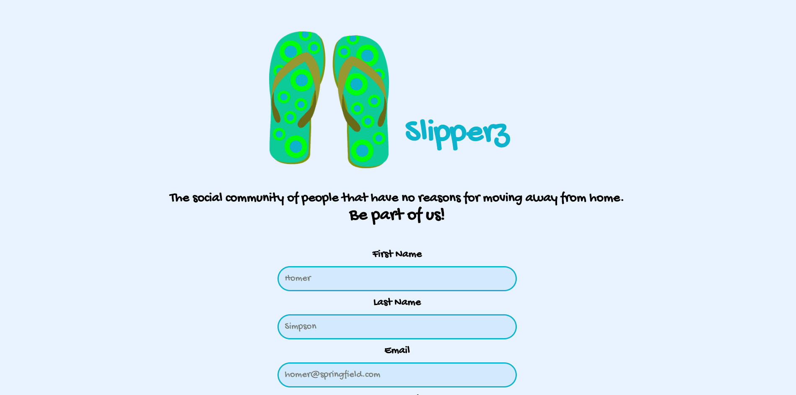
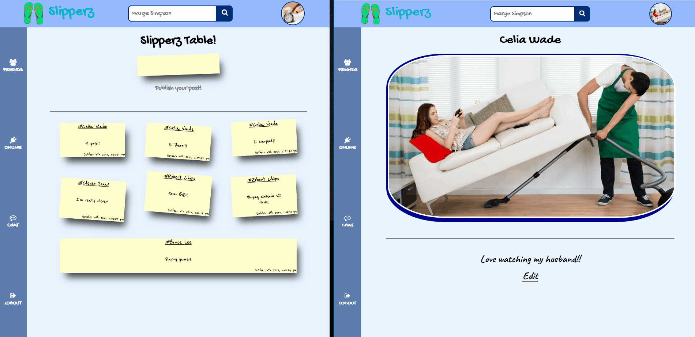
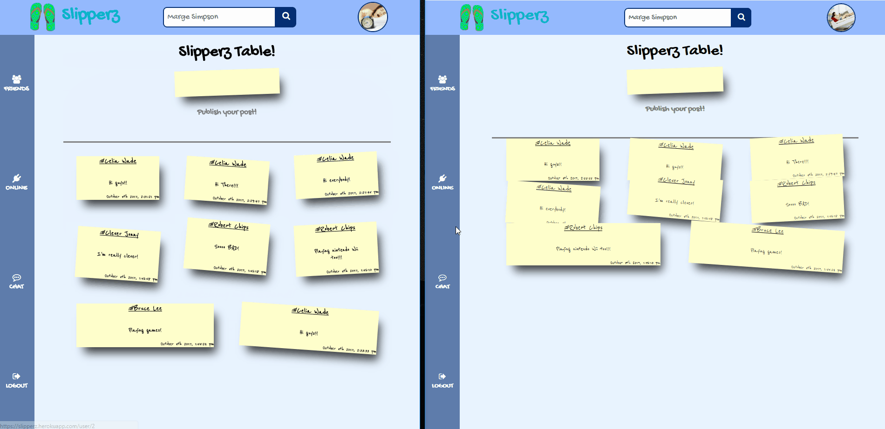

# Slipperz

### Table of contents

*   [Website](#website)
*   [Overview](#overview)
*   [Description](#description)

### Website

[Slipperz](https://slipperz.herokuapp.com/)

### Overview

Slipperz is a social network relying on React JS, a powerful javascript library for building the user interfaces.
Users can create an account, add a bio about theirselves, make friends, write messages to the common board as well as private instant messages to other online users.
Main technologies used:
*   React JS
*   Redux
*   Socket.io
*   Express JS
*   PostgreSQL
*   AWS S3

### Description

Registration and Login. Passwords are hashed and salted server side before being saved into database. All forms include CSRF protection.

 
 

After logging in, the user can customize his profile page by adding a profile picture (then saved into AWS S3) and a bio.

 
 

Slipperz is a social network, so users are able to request, accept, reject and delete friendships. 

'Friends' component renders the list of current friends and pending friendship requests. 

Users can also search for friends by name, see their profile and manage the friendship status there.

 
 

Every Slipperz member can post stickers on the common board, and all other users will instantly see changes on it.

 
 

The 'Online' component, instead, renders the entire list of online users. 
From there users can access to a 'WhatsApp-like' page where they can send private messages each other.

 
 

Instant messaging, for both public & private chats, has been implemented using 'socket.io', a Javascript library that enables real-time, two-way communication between clients and servers using WebSockets
